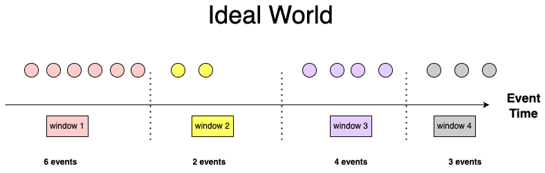
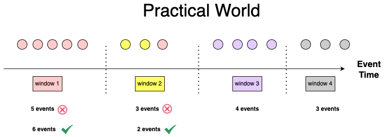
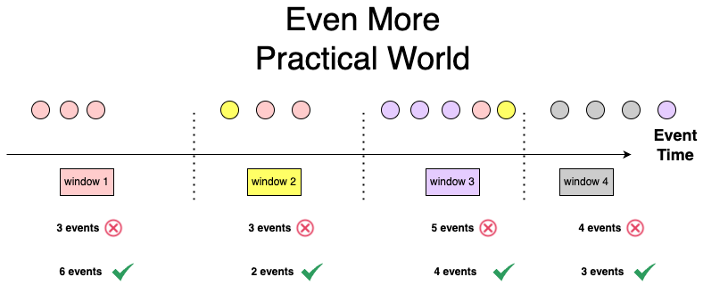
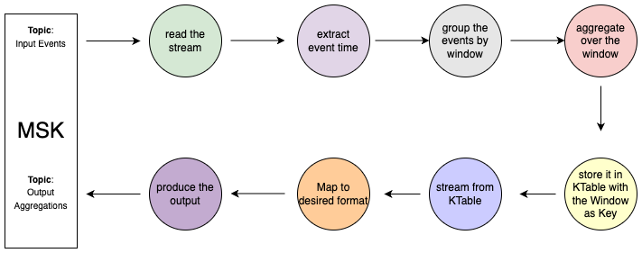

= Vertx-kafka-streams

image:https://img.shields.io/badge/vert.x-4.4.6-purple.svg[link="https://vertx.io"]
image:https://img.shields.io/badge/kafka-streams:3.6.0-purple.svg[link="https://kafka.apache.org/documentation/streams/"]

== Introduction
This is a simple example of using Kafka Streams with Vert.x.
There are two topologies defined here.

1. A stateless topology that simply reads from a topic, process and writes to another topic.
2. A stateful topology that reads from a topic, does some windowing and then writes to another topic. It can handle delayed events coming to the topic.

== Building

To launch the tests:
```
./gradlew clean test
```

To package the application:
```
./gradlew clean assemble
```

To run the application:
```
./gradlew clean run
```

To build the application
```
./gradlew clean build
```

== Stateless Topology

The stateless topology is defined in `TransactionConverterTopologyVerticle.kt` and it is very simple. It reads from a topic, does some processing and writes to another topic.

  streamsBuilder
    // Read from the topic and deserialize the event
    .stream(Constants.TOPIC_TRANSACTION_ALL_CURRENCIES, Consumed.with(Serdes.String(), transactionJsonSerde))
    // Filter out the events that are not in the configuration
    // and filter out the events that have negative amount
    .filter{ _, value -> value.currency in usdConversionRate.keys && value.amount > 0}
    // Convert the amount to USD
    .mapValues { _, value -> convertToUsd(value) }
    // Write to the topic
    .to(Constants.TOPIC_TRANSACTION_USD, Produced.with(Serdes.String(), transactionJsonSerde))

== Windowing with Delayed Messages

=== Time Semantics
  - Event Time: When the event is occurred / created
  - Ingestion Time: When the event is received by Kafka
  - Processing Time: When the event is processed by Processor

**In real world: **

  Event Time < Ingestion Time < Processing Time

*Why?*

1. It can take time for the event to reach to Kafka Broker. Because,

  - Client can cache it and then send it later
  - Network latency

2. Processors might not start to process as soon as the events arrive

=== Windowing
Window operation is needed for any kind of streaming application to do the aggregation within the window.

A possible use case could be

  Possible Fraudulence Attempt: Bumper transactions within 2 minutes for a bank account.

Window types supported Kafka Streaming API

1. Hopping
2. Tumbling
3. Session
4. Sliding

=== A Basic Use case

Suppose we have bank transaction events arriving in our system, and we want to calculate a basic metric: how many events happened per unit of time.

In an ideal world, the events are coming in correct order, no delay is there in between and coming exactly at the event actually happened.



We are counting events by windows within the event time.

So,

window 1 => 6 events

window 2 => 2 events

window 3 => 4 events

window 4 => 3 events

… … … … … … … … … … … …

… … … … … … … … … … … …

*Scenario I:* one event might be a little bit delayed to reach to the Kafka processor travelling all the way through the client and Kafka Broker.



So,

window 1 => 5 events (wrong)

window 2 => 3 events (wrong)

window 3 => 4 events

window 4 => 3 events

… … … … … … … … … … … …

… … … … … … … … … … … …

However, we want to calculate “how many events *happened* per unit of time”, so these results would be incorrect.

*Scenario II:* the result might be disaster for even more practical world.



So,

window 1 => 3 events (wrong)

window 2 => 3 events (wrong)

window 3 => 5 events (wrong)

window 4 => 4 events (wrong)

… … … … … … … … … … … …

… … … … … … … … … … … …

What can we do?

→ Discard the late event:

Scenario I: window 2, 3, 4 are correct. window 1 is wrong

Scenario II: all of them are wrong

→ Send the late event to another topic to Kafka

This will generate proper result. However we need build another stack (new topic, new consumer) to handle the late events.

→ Use Windowed KTable: correlate the late event with the right aggregation window.

=== Streaming aggregation and handle late events

At first, we need to use a time extractor to use the event time within the topology. For that we have created a TransactionTimeExtractor class and used it in the topology.

Afterwards we grouped the events by the window. We configured the window size with 1 minute without any grace period. Though we can use the grace period, our proposed solution can still generate the right result without it.

Finally, we aggregate the result within the window of events and populate the result in a *windowed KTable.*

    val aggregates =
      streamsBuilder
        .stream(Constants.TOPIC_TRANSACTION_ALL_CURRENCIES, Consumed.with(Serdes.String(), transactionJsonSerde)

          // use the event time
          .withTimestampExtractor(TransactionTimeExtractor()))

        // group the events by the window
        .groupBy({ _, _ -> "window" }, Grouped.with(Serdes.String(), transactionJsonSerde))
        .windowedBy(TimeWindows.ofSizeAndGrace(Duration.ofSeconds(60), Duration.ZERO))

        // do the aggregation and store it in a KTable
        .count(Materialized.with(Serdes.String(), Serdes.Long()))

Now we need to stream down the result from windowed KTable to another topic. To do so, we have mapped the result to desired output format and channelled it down to the destination topic.

 aggregates
      .toStream()
      .peek{ k, v -> println("k: $k, v:xz $v") }
      .map { ws, i -> KeyValue(

        // set the key of the destination kafka event
        "${Utils.convertEpochMillisToString(ws.window().start())}_${Utils.convertEpochMillisToString(ws.window().end())}",

        // set the value of the destination kafka event
        TransactionCount(
          OffsetDateTime.ofInstant(Instant.ofEpochMilli(ws.window().start()), ZoneOffset.UTC),
          OffsetDateTime.ofInstant(Instant.ofEpochMilli(ws.window().end()), ZoneOffset.UTC),
          i,
          OffsetDateTime.now(ZoneOffset.UTC)
          )
        )
      }
      .to(Constants.TOPIC_TRANSACTION_COUNT, Produced.with(Serdes.String(), JsonSerde(TransactionCount::class.java)))

When the delayed events come, the topology will update the aggregation with the window key in the KTable and channel down the updated value to the destination topic.

So the final topology will be:



==== Some notes

→ Since stream is unbounded, it is difficult to know the results are final. We might think of considering some standard for out dated period (and set the retention period of the Changelog topics) which will help us finalise the result.
